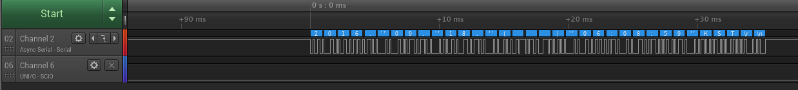
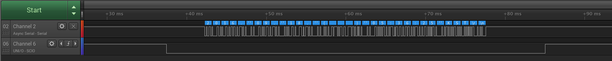

# raspi3_rts_on

Hardware RTS Enable for Raspberry Pi 3 
for The RS485
This code was referenced by below the link.
http://elinux.org/RPi_GPIO_Code_Samples#Direct_register_access

RTS is BCM17 Port  
Please See below link  
http://pinout.xyz/

Usage
==
<pre>
<code>
$git clone https://github.com/chandong83/raspi3_rts_on
</code>
</pre>

<pre>
<code>
$make -j4
</code>
</pre>

<pre>
<code>
$sudo ./rts_on
</code>
</pre>

Testing
==
<pre>
<code>
$date > /dev/ttyAMA0
</code>
</pre>

screenshot
==
Setting before

Setting after

ETC
==
if you don't want 'sudo' command
<pre>
<code>
$sudo chown root rts_on
$sudo chmod 4755 rts_on
</code>
</pre>
